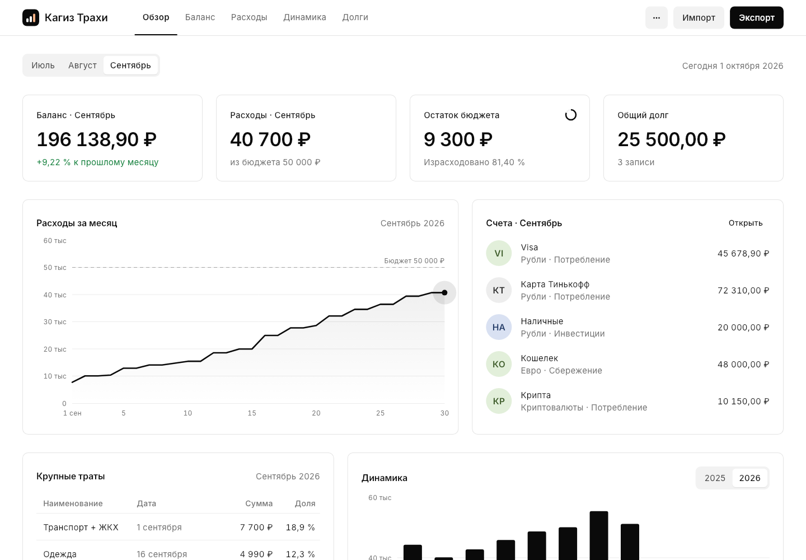

# Settle

Десктопное приложение (macOS / Windows) для ведения бюджета. Повторяет книгу
«Бюджет.xlsx» лист в лист и умеет импортировать/экспортировать её в том же
формате — с теми же стилями, объединёнными ячейками и работающими формулами.



## Вкладки

| Вкладка  | Лист Excel | Что внутри |
|----------|------------|------------|
| Обзор    | —          | Показатели, накопительные траты месяца, счета, крупные траты, динамика по году |
| Баланс   | Баланс     | Блоки месяцев: Источник · Валюта · Баланс · Статья, Итого / Сальдо / Изменение в %; таблица «Статья · Сумма · Доля» |
| Расходы  | Расходы    | Траты по дням месяца, Итого, Остаток прошлого месяца, Остаток, Бюджет; «Обязательные расходы в мес.» |
| Динамика | Динамика   | Месяцы × годы, «Итого» = среднее (AVERAGE) |
| Долги    | Долги      | Дата · Сумма · Кому я должен · На что брал, «Общий долг» |

При первом запуске — пустой шаблон на текущий месяц: «Октябрь 2026» на «Балансе» и «Расходах»,
все суммы и счета пустые. Названия месяцев («Октябрь 2026») можно переименовать — щелчком по заголовку.

## Пароль и код восстановления

При первом запуске приложение просит придумать пароль (не короче 6 символов), показывает
**код восстановления** — 10 латинских букв вида `KWJbhfKQJW` — и просит ввести его, чтобы убедиться,
что он записан. Дальше при каждом запуске нужен пароль; «Забыли пароль?» → ввести код → задать новый пароль.

В коде нет букв, которые легко спутать при записи от руки (I, O, строчные i, l, o), а у c, j, k, p, s, u,
v, w, x, z — только заглавные: если ввести их строчными, регистр исправится сам.

Данные хранятся в `settle.vault` в зашифрованном виде (`lib/security/vault.dart`): книга шифруется
случайным ключом (AES-256-GCM), а этот ключ — дважды: ключом из пароля и ключом из кода (оба —
Argon2id, 64 МиБ, около секунды). Поэтому код позволяет сменить пароль без потери данных,
а **без пароля и без кода данные не восстановить**.

Файлы первых версий вместо кода хранят фразу из 12 слов: пока она не заменена, доступ можно
восстановить ею, а после входа приложение один раз показывает новый код, и фраза перестаёт работать.

`budget.json` прежних версий (без пароля) при создании пароля переносится в `settle.vault`, а открытый
файл удаляется. На Windows он ищется и в папке под прежним названием (`%APPDATA%\com.mrgsdev\Кагиз Трахи`).

## Работа с ячейками

- Ячейки редактируются прямо в таблице: клик → ввод → `Enter` (или `Tab` — следующая ячейка), `Esc` — отмена.
- В суммах можно писать формулы, как в Excel: `=1500+300`, `=50000`, `=2000*3`. Они сохраняются
  и в экспорт попадают настоящими формулами Excel (у таких ячеек значок «ƒ»).
- Деление на ноль даёт 0 (а не `#ДЕЛ/0!`, как в Excel).
- Данные сохраняются автоматически (меню «•••» → «Папка с данными приложения»).
- Удаление месяца/долга, переход к следующему месяцу, импорт и сброс можно отменить кнопкой «Отменить».

Горячие клавиши: `⌘O` / `Ctrl+O` — импорт, `⌘S` / `Ctrl+S` — экспорт, `⌘1…5` / `Ctrl+1…5` — вкладки.

## Excel

**Экспорт** собирает книгу с нуля: 4 листа с теми же именами, раскладкой, ширинами колонок
и стилями, что в исходнике (стили и тема взяты из оригинального файла — `lib/excel/templates.dart`).
Все расчётные ячейки — формулы (`=SUM(C4:C8)`, `=C22-C9`, `=IFERROR((C22-C9)/C22,0)`,
`=IFERROR(I3/I6,0)`, `=C37-C34`, `=IFERROR(AVERAGE(B2:B13),0)` …) с уже посчитанными значениями;
Excel пересчитывает их при открытии.

**Импорт** читает книгу того же формата (в том числе сохранённую из Excel, Numbers или LibreOffice):
блоки месяцев ищутся по заголовку «Источник», дни — до строки «Итого» и т. д., так что
добавленные месяцы, источники, статьи и долги подхватываются.

**Пароль на файл.** Перед экспортом приложение спрашивает, поставить ли пароль на Excel-файл
(любой непустой). Файл шифруется так же, как это делает Excel 2010 и новее (MS-OFFCRYPTO «Agile»:
AES-256, SHA-512, 100 000 повторов; `lib/excel/office_crypto.dart`, контейнер OLE — `lib/excel/cfb.dart`),
поэтому Excel открывает его, спросив пароль. При импорте книги с паролем — в том числе запароленной
в самом Excel — приложение сначала спрашивает пароль. Книги, зашифрованные Excel 2007 (старый
способ «Standard»), не поддерживаются — их нужно пересохранить с паролем в новой версии Excel.

Отличия от исходного файла (намеренные):

- «Итого» на листе «Расходы» суммирует все дни месяца. В исходнике было `=SUM(C3:C32)` —
  31-е число не попадало в сумму.
- «Общий долг» = `=SUM(B2:B…)`. В исходнике было `=B2+B4+F2+B3` — ссылка на пустую ячейку F2 вне таблицы.
- Формулы с делением обёрнуты в `IFERROR(…;0)`: при нулевом итоге Excel показывает 0, а не `#ДЕЛ/0!`.
- Ручные подсветки отдельных ячеек на листе «Динамика» (B2, B8:C8) не переносятся.
- Колонки G и H «Обязательных расходов» в файле без заголовков; в приложении они подписаны «План» и «Факт».

Формулы, которые в исходнике работают именно так, сохранены как есть: «Изменение в %» =
`(Итого − Итого прошлого месяца) / Итого`, «Остаток» = `Бюджет − Итого` (без остатка прошлого месяца),
«Итого» в «Динамике» — среднее.

## Сборка

Нужен Flutter 3.44+.

```bash
flutter pub get
flutter run -d macos            # или -d windows
flutter build macos --release   # build/macos/Build/Products/Release/Settle.app
flutter build windows --release # build\windows\x64\runner\Release\Settle.exe
```

Сборка под Windows выполняется на Windows (Visual Studio с «Desktop development with C++»).

### Установщик и портативная версия для Windows

Нужен [Inno Setup](https://jrsoftware.org/isinfo.php) 6.3+ (`winget install JRSoftware.InnoSetup`).

```bash
installer\build.cmd                    # flutter build + установщик + портативная версия
installer\build.cmd -SkipFlutterBuild  # то же из готовой сборки
```

Результат (версия берётся из `pubspec.yaml`):

- `build\installer\Settle-Setup-<версия>.exe` — установщик;
- `build\installer\Settle-Portable-<версия>.zip` — портативная версия для флешки: распаковать
  и запустить `Settle.exe`. Из-за файла `portable.txt` рядом с exe данные хранятся в папке
  `UserData` там же (`lib/model/store.dart`), а не в профиле пользователя.

Установщик ставит приложение без прав администратора (или в Program Files для всех пользователей)
в выбранную пользователем папку (при обновлении в другую папку прежняя копия удаляется),
кладёт рядом Visual C++ runtime, создаёт ярлыки и запись в «Приложениях». Данные пользователя
(`%APPDATA%\com.mrgsdev\Settle`) при обновлении и удалении не затрагиваются.
Скрипт установщика — `installer/settle.iss`; `AppId` в нём менять нельзя: по нему Settle
ставится поверх версий под прежним названием («Кагиз Трахи») и убирает их exe и ярлыки.

## Тесты

```bash
flutter test
```

`test/excel_roundtrip_test.dart` — шаблон, импорт исходного «Бюджет.xlsx» (если он лежит на рабочем столе),
экспорт → импорт без потерь, формулы; `test/ui_test.dart` — ввод в ячейки, переход месяца, отмена;
`test/vault_test.dart` — шифрование, пароль, код, старые файлы с фразой, перенос `budget.json`;
`test/lock_screen_test.dart` — экраны пароля и восстановления;
`test/office_crypto_test.dart` — книга с паролем: OLE-контейнер, шифрование → расшифровка; книгу,
запароленную в Excel, можно проверить: `KT_XLSX_LOCKED=файл KT_XLSX_PASSWORD=пароль flutter test test/office_crypto_test.dart`;
`test/excel_dialogs_test.dart` — вопрос о пароле при экспорте и ввод пароля при импорте;
`test/screenshots_test.dart` — рендер вкладок (`KT_SHOTS=папка flutter test test/screenshots_test.dart`).

## Структура

```
lib/
  model/    budget.dart (листы), calc.dart (формулы как в Excel), store.dart (хранение, операции)
  security/ vault.dart (шифрование, пароль, код восстановления)
  excel/    xlsx_writer.dart, xlsx_reader.dart, budget_excel.dart (раскладка листов), templates.dart,
            office_crypto.dart + cfb.dart (пароль на книгу)
  ui/       shell.dart, lock_screen.dart, excel_dialogs.dart, pages/*, widgets/*, theme.dart,
            format.dart, actions.dart
```

Иконка: `windows/runner/resources/app_icon.ico` (exe и установщик), `macos/Runner/Assets.xcassets/AppIcon.appiconset`
и `assets/icon/settle.png` (логотип внутри приложения).
